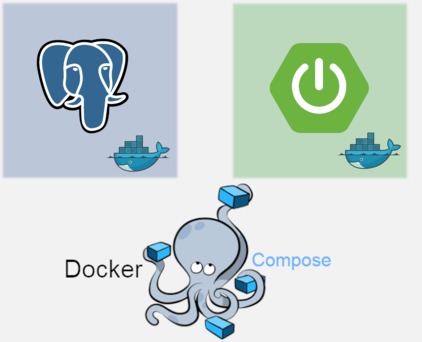

## [spring-boot-docker-multicontainer-demo](#spring-boot-postgres-demo)

Run spring boot application and postgres as multicontainer using docker compose

## [Prerequisite / Libraries used](#Prerequisite)
* Docker
* Spring Boot
* Spring Configuration
* Spring REST Controller
* Postgres

## [Compilation command](#compilation-command)
```mvn clean package -DskipTests```

## [Build Docker image](#build-docker-image)
```docker-compose build```

## [Run the Docker containers](#run-docker-containers)
```docker-compose up```

## [Verify image creation](#verify-image-creation)
```docker image ls```

## [API end-points](#API-end-points)

| Method            | URL          | Description                                                                                   |
|:------------------|:------------------|:----------------------------------------------------------------------------------------------|
| `POST`			| `http://localhost:8080/user/save`		| Add new user using the User model.	Eg:{"name":"Mark"}|
| `GET`			| `http://localhost:8080/user/all`		| This returns all the users.													|
| `GET`			| `http://localhost:8080/user/{id}}`	| This will delete the user by id.|


## [Removing Docker Image](#removing-docker-image)

> Prints the docker image name and tag

```docker image ls```

> Remove a docker image

```docker image rm <imageName>:<tag>```

`Eg: docker image rm app-springboot-postgresql`


## [Reference](#reference)

Please follow on my medium for step by step executions.

https://medium.com/@reachansari/spring-boot-and-spring-data-jpa-postgres-multi-container-with-docker-compose-f94f56622061


